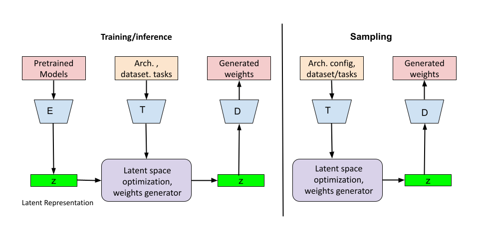

# **Evolving Neural Networks in Latent Space**
A framework that encodes and learns from diverse architectures, enabling rapid adaptation, new model generation, and performance gains via latent space exploration.

### Figure 1 
This figure presents the overall framework for evolving neural networks in latent space. The encoder–decoder (E–D) blocks represent the Variational Autoencoder (VAE), while the task–architecture–dataset encoder is denoted by **T**. By encoding the weights of a large set of pretrained models into a shared latent representation, this approach enables faster adaptation to new tasks and architectures, providing better initial weights for previously unseen or novel model designs.

---

### Overview  
In this project, we leverage the extensive availability of pretrained models to reduce the cost and complexity of building new models from scratch.  

1. **Step 1**: Train a **Variational Autoencoder (VAE)** on a diverse collection of pretrained model weights spanning various architectures and datasets. This produces a **latent embedding** that captures essential weight patterns.  
2. **Step 2**: Perform various latent space optimization including learning the distribution of the pretrained weights conditioned on their corresponding pretrained tasks and architectures descriptions to allow improving the performance with no access to pretrained dataset as well as to generate high-quality initial weights tailored to new tasks or architectures.  

This significantly streamlines the process of model development and fine-tuning.

---

### Contribution  
Building new deep learning models from the ground up can be time-consuming and resource-intensive. Our research tackles this challenge by introducing a **VAE-based strategy** that learns a unified latent representation of pretrained models drawn from diverse architectures and datasets.  

Key benefits include:  
- **Rapid Weight Generation**: Generate high-quality initial weights for new or unseen neural network designs.  
- **Reduced Development Cost**: Minimize the resource requirements for model development.  
- **Enhanced Adaptability**: Easier adaptation to changing tasks and architectures.
- **Improving performance without fine-tuning**: Enhancing model performance by exploring the latent space.  

This approach exemplifies how leveraging collective intelligence across models can boost productivity and drive innovation in the field of deep learning.

